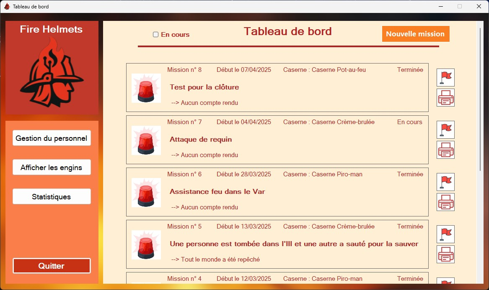
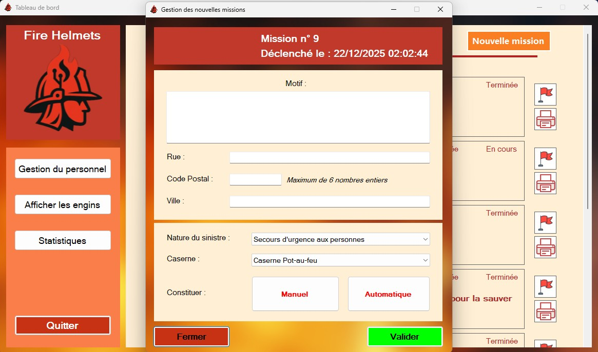
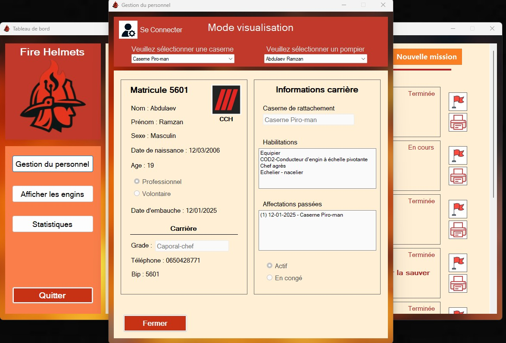
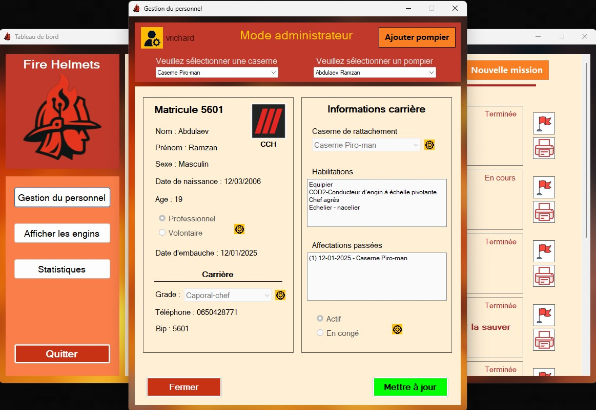
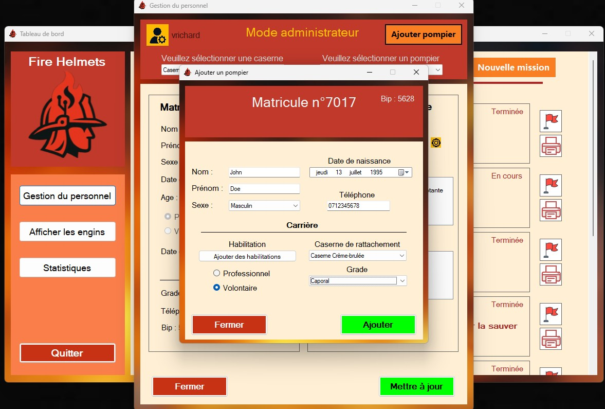

# 🚒 Projet Gestion Caserne
[](https://github.com/PanDox42/winforms-gestion-caserne)


Une application **Windows Forms** en **C#** permettant de gérer une caserne de pompiers : interventions, véhicules, pompiers, et habilitations.  

---

## 🔥 Présentation

Le **Projet Gestion Caserne** a pour but de modéliser la gestion opérationnelle d’une caserne de pompiers.  
L’application permet de manipuler des données telles que :
- Les pompiers et leurs habilitations  
- Les véhicules disponibles  
- Les interventions et leur attribution  
- Les ressources mobilisées pour chaque intervention  

L’interface graphique en **WinForms** rend l’usage intuitif et adapté à un environnement de gestion interne.

---

## 🧠 Fonctionnalités

- 👨‍🚒 **Gestion des pompiers** (ajout, modification, suppression)
- 🚒 **Gestion des véhicules** selon leur disponibilité et type
- ⚠️ **Gestion des interventions** : type, localisation, ressources nécessaires
- 🧾 **Sélection automatique ou manuelle** des pompiers et véhicules selon les habilitations requises quand on lance une mission 
- 🔍 **Recherche et filtrage** dans les listes
- 💾 **Sauvegarde des données** via un `DataSet` local (mode déconnecté) ainsi qu'à une `base de données` (mode connecté)
- 🖨 **Generation des comptes rendus des missions** en PDF dans le dossier `comptes_rendus` lorsque le bouton de génération est cliqué dans l'application

---

## 🏗️ Architecture & technologies

- **Langage :** C#  
- **Framework :** .NET (Windows Forms)  
- **Données :** `DataSet`, fichiers XML et base de données en `.db` 
- **IDE recommandé :** Visual Studio  
- **Patrons utilisés :** séparation entre couches UI / logique / données  

---

## 🖼️ Quelques images de l'application


<div align="center">

# Tableau de Bord


# Nouvelle Mission


# Gestion du Personnel (Mode Visualisation)


# Gestion du Personnel (Mode Administrateur)


# Ajouter du Personnel


</div>

---

## ⚙️ Installation & configuration

### 1. Prérequis
- Windows

Si vous voulez éditer le projet : 
- Visual Studio (avec le workload `.NET desktop development`)  

### 2. Cloner le dépôt
```git
git clone https://github.com/PanDox42/winforms-gestion-caserne
```

### 3. Lancer l'application 
```path
'SAE A21-D21 - Projet Caserne\bin\Debug\SAE A21-D21 - Projet Caserne.exe'
```
